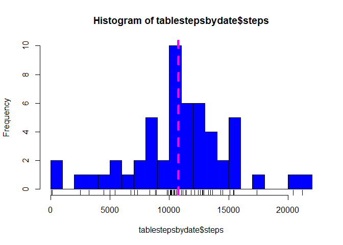
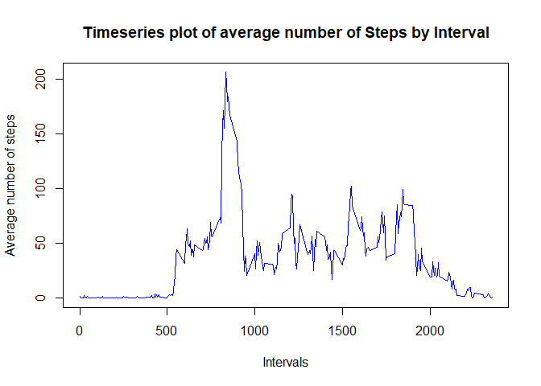
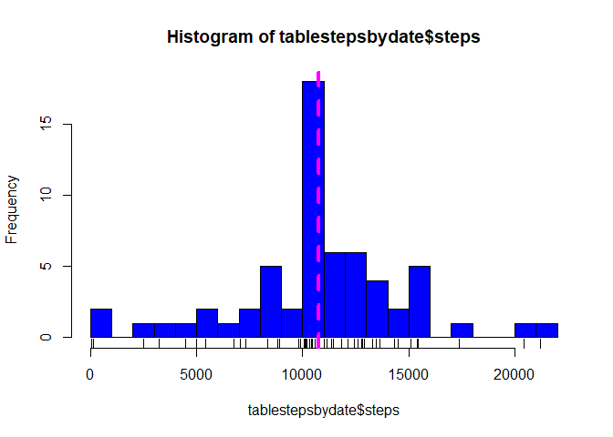
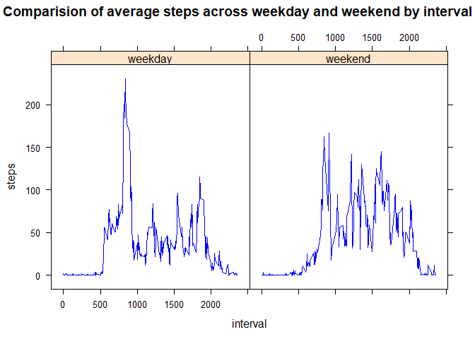

Loading and preprocessing the data
----------------------------------

Code below reads the data from working directory, it also converts the
date column which is appearing as “character”into “date”object with ymd
command from lubridate library

    library(lubridate)

    ## Warning: package 'lubridate' was built under R version 4.0.2

    ## 
    ## Attaching package: 'lubridate'

    ## The following objects are masked from 'package:base':
    ## 
    ##     date, intersect, setdiff, union

      pathfile<-paste(getwd(),"/activity.csv",sep = "")
      dataactivity<-read.csv(pathfile)
      dataactivity$date<-ymd(dataactivity$date)

Analysis of total number of steps taken per day
-----------------------------------------------

In this subsection ,we will show a graphical display of total number of
steps in a day beside finding the mean and median of total steps in a
day.

We start by creating a data frame of total number of steps by day

     tablestepsbydate<-aggregate(steps~date,dataactivity,sum)

### Histogram

We create a histogram with a rug and abline

     hist(tablestepsbydate$steps,col="blue",breaks = 20)
      rug(tablestepsbydate$steps)
      abline(v=median(tablestepsbydate$steps),col="magenta",lwd=4,lty=2)

### Mean and Median of the total number of steps taken per day

    Meanbeforeimpute<-round(mean(tablestepsbydate$steps))
    Medianbeforeimpute<-round(median(tablestepsbydate$steps))

     paste("Mean number of steps taken is",
     Meanbeforeimpute,sep=" ")

    ## [1] "Mean number of steps taken is 10766"

    paste("Median number of steps taken is" ,
    Medianbeforeimpute,sep=" ")

    ## [1] "Median number of steps taken is 10765"

### Time series plot by interval

We will first create a data frame of total steps by interval followed by
time series plot

     tableavgstepsbyinterval<-aggregate(steps~interval,dataactivity,mean)

      plot(tableavgstepsbyinterval$interval,tableavgstepsbyinterval$steps,
           type="l", col="blue",
           main = "Timeseries plot of average number of Steps by Interval",
           xlab = "Intervals",ylab = "Average number of steps")

      maxstepsrow<-which.max(tableavgstepsbyinterval$steps)
      
      maxinterval<-tableavgstepsbyinterval[maxstepsrow,"interval"]
      
      paste("Interval with maximum number of steps is",maxinterval,sep = " ")

    ## [1] "Interval with maximum number of steps is 835"

Analysis on total number of steps post imputing the data
--------------------------------------------------------

Imputing strategy used is to replace steps with NA for a particular
interval with the mean for that 5-minute interval.

We will use a “For”loop to fetch value for a mean for a particular
interval from the table “tableavgstepsbyinterval” created above.

      rowsactivity<-dim(dataactivity)[[1]]
      rowslookup<-dim(tableavgstepsbyinterval)[[1]]
      
      for(i in 1:rowsactivity){
        if(is.na(dataactivity[i,1])){
          for( j in 1:rowslookup ){
            if(tableavgstepsbyinterval[j,1]==dataactivity[i,3]){
              dataactivity[i,1]<-tableavgstepsbyinterval[j,2]
            }
          }
        } 
      }

### Histogram after imputing

    tablestepsbydate<-aggregate(steps~date,dataactivity,sum)

     hist(tablestepsbydate$steps,col="blue",breaks = 20)
      rug(tablestepsbydate$steps)
      abline(v=median(tablestepsbydate$steps),col="magenta",lwd=4,lty=2)

### Mean and Median of the total number of steps taken per day after impute

    Meanafterimpute<-round(mean(tablestepsbydate$steps))
    Medianafterimpute<-round(median(tablestepsbydate$steps))

     paste("Mean number of steps after impute is",
     Meanafterimpute,sep=" ")

    ## [1] "Mean number of steps after impute is 10766"

    paste("Median number of steps after impute is" ,
    Medianafterimpute,sep=" ")

    ## [1] "Median number of steps after impute is 10766"

    compmean<-Meanafterimpute-Meanbeforeimpute
    compmedian<-Medianafterimpute-Medianbeforeimpute

    if(compmean==0){"Mean after imputing has not changed(result was rounded)"}

    ## [1] "Mean after imputing has not changed(result was rounded)"

    if(compmean>0){paste("Mean number of steps after impute has increased by",compmean,sep = " " )}

    if(compmean<0){paste("Mean number of steps after impute has decreased by",compmean,sep = " " )}

    if(compmedian==0){"Median after imputing has not changed(result was rounded)"}
     
    if(compmedian>0){paste("Median number of steps after impute has increased by",compmedian,sep = " " )}

    ## [1] "Median number of steps after impute has increased by 1"

    if(compmedian<0){paste("Median number of steps after impute has decreased by",compmedian,sep = " " )}            

### Comparision of Weekday and Weekend

    daysofdata<-weekdays(dataactivity$date)
    weekendlogical<- daysofdata %in% c("Saturday","Sunday")
    daysofdata[weekendlogical]<-"weekend"
    daysofdata[!weekendlogical]<-"weekday"

    dataactivity$daytype<-as.factor(daysofdata)

    tableavgstepsbydaytypeinterval<-aggregate(steps~daytype+interval,dataactivity,mean)
    library(lattice)
    xyplot(steps~interval|daytype,data=tableavgstepsbydaytypeinterval,
           type="l",col="blue",main="Comparision of average steps across weekday and weekend by interval")

